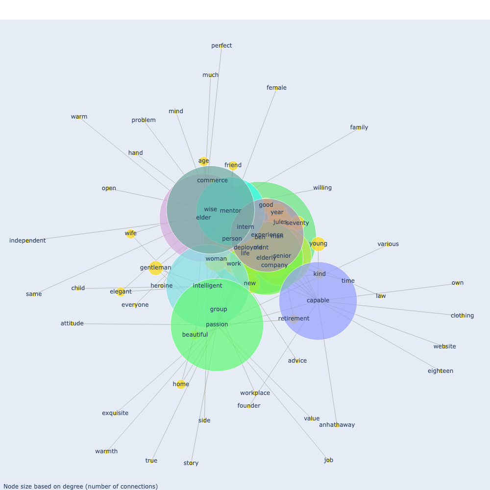
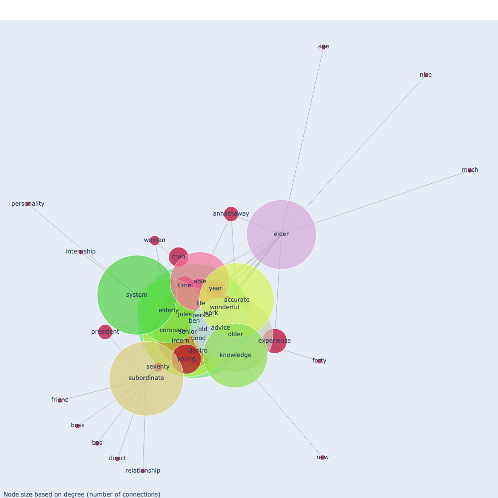

# No Country for Old Workers? Exploring Cross-Cultural Views on Aging Workforce

This repository contains the materials and code for the research project *No Country for Old Workers? Exploring Cross-Cultural Views on Aging Workforce*. This study investigates expectations and attitudes toward senior workers across different cultural backgrounds by analyzing reviews of *The Intern*, a movie depicting a senior intern adapting to a young, dynamic workplace.

## Table of Contents

- [No Country for Old Workers? Exploring Cross-Cultural Views on Aging Workforce](#no-country-for-old-workers-exploring-cross-cultural-views-on-aging-workforce)
  - [Table of Contents](#table-of-contents)
  - [Introduction](#introduction)
  - [Data Collection](#data-collection)
  - [Methods](#methods)
    - [Tools and Libraries](#tools-and-libraries)
  - [Results](#results)
  - [Visualizations](#visualizations)
    - [North America](#north-america)
    - [China \& Taiwan](#china--taiwan)
    - [Japan](#japan)
    - [South Korea](#south-korea)
    - [Technical Details](#technical-details)
  - [Installation and Usage](#installation-and-usage)

## Introduction

As global populations age, understanding how societies view the aging workforce becomes crucial. Active aging offers benefits like increased well-being, financial security, and reduced ageism. However, cultural perceptions of older workers vary. This study explores these differences through a keyword network analysis of reviews on *The Intern*, which provides insights into each culture’s expectations for senior workers.

## Data Collection

Data was sourced from online reviews of *The Intern*, gathered from major platforms in different regions:

- **North America**: Rotten Tomatoes, IMDb
- **South Korea**: CGV
- **Japan**: Yahoo Japan, Eiga, Filmarks
- **China & Taiwan**: YouTube

## Methods

We used **Keyword Network Analysis** to assess relationships between keywords in the reviews, examining connections between frequently co-occurring terms. Key steps include:

1. **Data Preprocessing**: Reviews in non-English languages were translated into English.
2. **Tokenization and Lemmatization**: Punctuation and special characters were handled, and parts of speech were tagged.
3. **Keyword Extraction**: Nodes in the network represent keywords, and edges represent co-occurrence frequencies.
4. **Community Detection**: Using the Louvain algorithm to identify keyword clusters relevant to each cultural context.

### Tools and Libraries

- **Navertrans 0.1.1** for translation
- **NLTK** for lemmatization and part-of-speech tagging
- **NetworkX** and **Plotly** for visualization

## Results

The study reveals distinct cultural differences:

- **Western Views**: Emphasis on interpersonal relationships and social traits, e.g., keywords like "friend" and "guidance."
- **Eastern Views**: Focus on professional roles and intrinsic qualities like "trust" and "growth."
- **Within East Asia**: Variances exist. Japan values organizational roles, South Korea emphasizes family-like relationships, and China and Taiwan focus on seniors’ expertise and capabilities.

## Visualizations

The following visualizations showcase the keyword networks derived from the review data of *The Intern*, demonstrating how each region perceives the senior workforce. These keyword networks highlight both shared and unique perspectives across cultures.

### North America


This graph illustrates North American perspectives, emphasizing personal relationships and guidance roles often associated with senior workers.

### China & Taiwan


In China and Taiwan, the network highlights the focus on seniors' vocational abilities, such as intelligence and capability, reflecting respect for experience and expertise.

### Japan


Japan’s keyword network shows a structured approach, valuing seniors in organizational roles and reflecting a high regard for experience and hierarchy in professional settings.

### South Korea


In South Korea, keywords reveal a blend of professional and familial perceptions, with seniors viewed as mentors and even extended family within the workplace.

### Technical Details

These visualizations were generated using **NetworkX** and **Plotly** libraries, where keywords act as nodes, and edges represent the frequency of co-occurrences between terms. Edge thickness and node size indicate the strength of these connections, with closer distances representing higher frequencies.

## Installation and Usage

1. **Clone the Repository**:
   ```bash
   git clone https://github.com/yourusername/nocountryforoldworkers.git

2. Install Required Packages:
   

    ```bash
    pip install -r requirements.txt
    ```

3. Run Analysis:

    Open the Jupyter notebooks located in the notebooks folder to run the analysis steps.
    The analysis is divided into two main notebooks:
    1_Preprocessing.ipynb: This notebook handles data preprocessing, including translation, tokenization, and lemmatization.
    2_EDA_and_Keyword_network.ipynb: This notebook performs exploratory data analysis (EDA) and builds the keyword network visualizations.
    You can launch Jupyter Notebook and navigate to the notebooks folder:

    ```bash
    jupyter notebook
    ```
    
4. View Results:

    Generated visualizations and tables are saved in the /data/research_results directory, under graph_visualisation and word_cloud folders.

    This update clarifies the use of the notebooks for analysis and guides users through the notebook-based workflow. Let me know if you'd like further customization!


poetry run python -m src.run_pipeline --cfg conf/config.yaml
mlflow ui  # 결과 확인(선택)